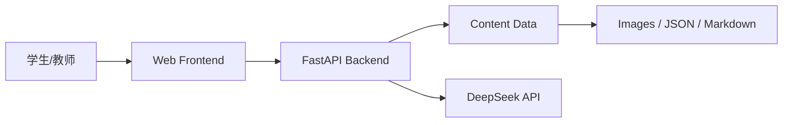
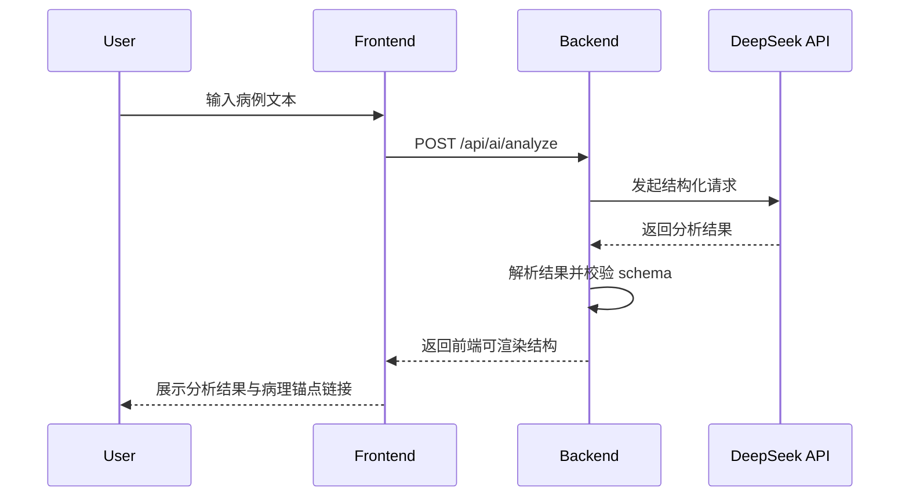

# COPD Explorer Architecture Design

**版本**：V0.1
**状态**：MVP 架构草案
**关联文档**：docs/prd.md、docs/resign.md

---

## 1. 设计目标

本架构目标是支撑一个面向医学教学场景的 Web 平台，重点满足以下要求：

- 支持大体标本与镜下切片的联动浏览；
- 支持病理标注、机制链、临床推导的展示；
- 支持 AI 辅助诊断，并将结果回溯到病理证据锚点；
- 保证教学用途和医学安全边界；
- MVP 以可快速开发、可验证交互、便于后续扩展为优先。

---

## 2. 架构总体思路

建议采用“前端展示层 + 后端服务层 + 内容数据层 + AI 推理层”的分层架构。

### 2.1 设计原则

- 先实现 MVP，避免过度设计；
- 前后端职责清晰，内容与展示解耦；
- 所有 AI 请求由后端统一处理，避免前端暴露密钥；
- 使用稳定 Anchor ID 作为所有内容之间的关联基础；
- 支持后续从静态内容演进到内容管理系统。

### 2.2 推荐技术栈

- 前端：React + TypeScript + Vite
- 状态管理：Zustand 或 React Context + React Query
- 后端：Python FastAPI
- 数据校验：Pydantic
- 内容存储：MVP 使用 JSON / Markdown / 静态资源文件，后续可迁移到数据库
- AI：DeepSeek OpenAI 兼容接口
- 部署：前端静态托管，后端容器部署

### 2.3 适合小白/初期落地的推荐方案

基于你这个项目的特点，我建议采用“最小可行架构”而不是一开始就做复杂系统：

#### 2.3.1 前端建议：React + TypeScript

原因：

- 学习资料最多，社区生态成熟；
- 适合做交互型页面，比如热区点击、切片联动、锚点跳转；
- 后续如果要扩展成更完整教学平台，迁移成本较低。

#### 2.3.2 后端建议：FastAPI

原因：

- Python 语法更容易上手；
- 接入 AI 接口非常方便；
- 对于初学者来说，代码结构比很多后端框架更清晰。

#### 2.3.3 数据建议：MVP 先用静态 JSON 文件，不要一开始上数据库

原因：

- 你现在最重要的是把“病理标本 → 切片 → 机制 → AI 分析”这条链跑通；
- 静态 JSON 非常适合放标本、切片、标注和机制内容；
- 后续如果内容变多，再改成数据库不会太难。

#### 2.3.4 AI 建议：后端统一调用，前端只负责展示

原因：

- 最安全，也最符合项目要求；
- 以后即使改模型，也只需要改后端，不需要改前端；
- 对初学者来说，更容易控制错误和调试。

#### 2.3.5 AI 输出建议：强约束 JSON schema

这是我最推荐的做法：

- 让 AI 返回固定结构的 JSON；
- 前端只读取这些字段进行展示；
- 这样更容易保证“病理基础”“证据锚点”“免责声明”这些内容稳定出现。

#### 2.3.6 开发顺序建议

建议按下面顺序推进：

1. 先做前端页面骨架：主页、病理探索页；
2. 再把静态内容数据准备好：标本、切片、标注、机制；
3. 再实现热区点击与内容联动；
4. 最后接入 AI 分析接口。

这条路线最符合你当前的目标：先把核心教学流程跑通，再考虑更复杂的功能。

### 2.4 系统上下文



---

## 3. 业务边界与模块划分

### 3.1 前端模块

前端负责交互展示与本地状态管理，核心页面如下：

- Home 页面：介绍平台和学习路径
- Explorer 页面：病理标本联动浏览
- Mechanism 页面：机制链展示
- AI Diagnosis 页面：病例分析与 AI 输出展示

### 3.2 后端模块

后端负责内容服务、AI 请求、结构化返回和安全控制，建议划分为：

- Content Service：提供标本、切片、标注、机制、临床内容
- AI Service：接收病例输入，调用 DeepSeek，返回结构化结果
- Anchor Service：解析和查询 Anchor 关系
- Health / Metadata Service：提供系统状态和版本信息

### 3.3 内容资源层

内容资源建议以“数据 + 资源文件”分离：

- 数据文件：JSON / YAML / Markdown
- 图片资源：PNG / WEBP / SVG
- 资源目录建议如下：

```text
content/
  specimens/
  slides/
  annotations/
  mechanisms/
  clinical/
  ai_prompts/
```

---

## 4. 前端架构设计

### 4.1 目录建议

```text
src/
  app/
    routes/
    layouts/
    providers/
  pages/
    HomePage/
    ExplorerPage/
    MechanismPage/
    AIDiagnosisPage/
  components/
    layout/
    specimen/
    slide/
    annotation/
    mechanism/
    clinical/
    ai/
    common/
  features/
    explorer/
    diagnosis/
  hooks/
    useAnchorNavigation.ts
    useLearningState.ts
  data/
    content/
  services/
    api.ts
    content.ts
    ai.ts
  stores/
    learningStore.ts
  types/
    anchor.ts
    content.ts
    ai.ts
  utils/
    anchor.ts
    format.ts
  assets/
    images/
    icons/
```

### 4.2 关键前端职责

- 负责渲染大体标本、切片、标注、机制链和 AI 结果；
- 维护统一学习状态，例如当前 Anchor、当前标注、当前 AI 结果；
- 处理 URL 中的 Anchor 参数，并在页面刷新时恢复上下文；
- 处理加载、空状态、错误状态和异常回退。

### 4.3 状态设计

建议以一个统一的学习状态对象管理，确保页面之间可以共享学习上下文：

```ts
interface LearningState {
  currentAnchor: string | null;
  currentSpecimen: string | null;
  currentSlide: string | null;
  currentAnnotation: string | null;
  currentMechanism: string | null;
  currentAIResult: AIResult | null;
  history: string[];
  isLoading: boolean;
  error: string | null;
}
```

其中：

- `currentAnchor`：当前上下文锚点；
- `history`：用户访问路径，便于回退和上下文恢复；
- `currentAIResult`：保存最近一次 AI 结果，方便在病理探索页回溯。

### 4.4 前端交互流程

1. 用户进入 Explorer 页面；
2. 点击大体标本热区；
3. 前端请求当前 Anchor 对应的切片和标注内容；
4. 更新右侧与下方相关内容；
5. 点击机制节点或 AI 证据链接时，回到相应的病理上下文。

---

## 5. 后端架构设计

### 5.1 API 服务层

建议将后端分成三个层次：

- Router 层：负责接收 HTTP 请求；
- Service 层：负责业务逻辑；
- Repository / Data Layer：负责从文件或数据库读取内容。

这三层的设计可以确保后端不会因为业务逻辑变复杂而变得混乱，也便于后续替换内容来源或接入新 AI 模型。

### 5.2 推荐目录结构

```text
backend/
  app/
    main.py
    core/
      config.py
      security.py
    routers/
      content.py
      ai.py
      health.py
    services/
      content_service.py
      ai_service.py
      anchor_service.py
    schemas/
      content.py
      ai.py
    data/
      specimens.json
      slides.json
      annotations.json
      mechanisms.json
      clinical.json
```

### 5.3 后端职责

- 提供内容 API，例如获取指定 Anchor 的完整上下文；
- 处理 AI 请求并返回结构化结果；
- 校验输入内容，防止不安全的 AI 使用模式；
- 统一处理错误、超时、解析失败和降级状态；
- 提供统一的内容版本接口，方便后续教学审核和内容更新。

### 5.4 后端核心流程

```text
请求进入 API
  ↓
参数校验
  ↓
调用 Service
  ↓
读取内容或调用 AI
  ↓
构造结构化响应
  ↓
返回给前端
```

这条流程足够清晰，适合你后续继续拓展到更完整的平台。

---

## 6. 数据模型设计

### 6.1 内容对象设计

建议将内容建模为一组带稳定 ID 的对象，便于跨页面和跨模块关联。

#### Specimen

```json
{
  "id": "specimen_bullae_001",
  "type": "specimen",
  "title": "胸膜下肺大疱标本",
  "image": "/assets/specimens/lung-001.webp",
  "hotspots": ["hotspot_bullae_001"]
}
```

#### Hotspot

```json
{
  "id": "hotspot_bullae_001",
  "label": "胸膜下肺大疱",
  "anchor": "specimen_bullae_001",
  "x": 0.42,
  "y": 0.28,
  "width": 0.16,
  "height": 0.12
}
```

#### Slide

```json
{
  "id": "slide_alveolar_break_001",
  "type": "slide",
  "title": "肺泡壁断裂切片",
  "image": "/assets/slides/alveolar-break-001.webp",
  "anchor": "slide_alveolar_break_001"
}
```

#### Annotation

```json
{
  "id": "annotation_alveolar_break_001",
  "type": "annotation",
  "name": "肺泡壁断裂",
  "description": "肺泡壁结构破坏，提示肺气肿相关改变",
  "anchor": "annotation_alveolar_break_001",
  "links": {
    "specimen": "specimen_bullae_001",
    "slide": "slide_alveolar_break_001",
    "mechanism": "mechanism_elastic_loss_001",
    "clinical": "clinical_emphysema_001"
  }
}
```

#### Mechanism

```json
{
  "id": "mechanism_elastic_loss_001",
  "type": "mechanism",
  "title": "弹性蛋白酶失衡",
  "nodes": ["inflammation", "protease", "alveolar_wall_damage", "airflow_limitation"],
  "anchor": "mechanism_elastic_loss_001"
}
```

#### AI Result

```json
{
  "assessment": {
    "disease": "COPD",
    "likelihood": "high",
    "confidence": 0.86,
    "basis": ["长期吸烟史", "持续气流受限"]
  },
  "evidence": [
    {
      "text": "肺泡结构破坏可导致肺气肿相关改变",
      "anchorId": "annotation_alveolar_break_001"
    }
  ],
  "differential": [],
  "recommendation": ["结合完整肺功能和影像学资料进一步评估"],
  "disclaimer": "仅供医学学习与辅助参考，不替代专业医疗判断。"
}
```

### 6.2 Anchor 设计

Anchor 是系统的核心关联机制。建议统一使用稳定、可读、全局唯一的字符串标识：

```text
specimen_bullae_001
slide_alveolar_break_001
annotation_alveolar_break_001
mechanism_elastic_loss_001
```

每个 Anchor 都应具备：

- 目标对象类型；
- 名称；
- 对应内容资源；
- 相关联的上下游 Anchor。

---

## 7. API 设计

### 7.1 内容接口

为了让前端和后端职责清晰，建议将内容接口设计为“按 Anchor 查询”和“按页面需要聚合查询”两类：

- 细粒度接口：根据单个 Anchor 返回内容；
- 聚合接口：根据当前学习上下文返回完整页面所需数据。

#### 获取内容上下文

```http
GET /api/content/anchor/{anchorId}
```

返回：

- 当前 Anchor 对应的内容；
- 相关的切片、机制、临床卡片；
- 可跳转的上下游/下游 Anchor。

#### 获取首页内容

```http
GET /api/content/home
```

返回：

- 首页引导信息；
- 学习路径；
- 核心能力摘要。

### 7.2 AI 接口

#### 提交病例分析

AI 接口建议采用“短请求 + 结构化输出”的方式，避免前端对复杂的 AI 响应进行二次处理。

```http
POST /api/ai/analyze
Content-Type: application/json
```

请求体：

```json
{
  "patientInfo": {
    "age": 68,
    "sex": "男",
    "smokingHistory": "吸烟 50 年"
  },
  "symptoms": ["活动后气促 5 年"],
  "tests": {
    "lungFunction": "FEV1/FVC=58%，FEV1 占预计值 48%",
    "ctDescription": "双肺透亮度增高，可见多发无壁透亮区"
  },
  "pathologyContext": []
}
```

返回结构：

```json
{
  "assessment": {},
  "evidence": [],
  "differential": [],
  "recommendation": [],
  "disclaimer": ""
}
```

### 7.3 健康检查接口

```http
GET /api/health
```

用于部署后检查服务是否正常运行。

---

## 8. AI 集成设计

### 8.1 集成方式

AI 服务由后端统一封装，前端只负责提交输入和展示结果。这样做有两个好处：

- 避免前端暴露 DeepSeek API 密钥；
- 便于对结果进行结构化校验与降级处理。

### 8.2 请求流程



### 8.3 输出校验

后端应对 AI 输出做以下处理：

- 检查是否包含必要字段；
- 检查 evidence 中的 anchorId 是否存在；
- 对缺失/异常字段进行降级处理；
- 对不安全或过度确定的结论进行提示。

### 8.4 Prompt 设计原则

Prompt 应保持“教学导向”而非“临床决策导向”：

- 明确说明这是教学辅助；
- 要求提供依据与不确定性；
- 强制要求将分析与病理证据关联；
- 避免输出伪装为确定诊断的结论。

---

## 9. 部署与运行架构

### 9.1 MVP 部署建议

建议采用分离部署：

- 前端：Vercel / Netlify / GitHub Pages（静态资源）
- 后端：Render / Railway / Fly.io / 云服务器容器
- 图片资源：对象存储或静态文件托管

### 9.2 运行时结构

```text
Browser
  -> Static Frontend
  -> Backend API
  -> Object Storage / Static Assets
  -> DeepSeek API
```

### 9.3 环境变量

后端应使用环境变量管理：

- DEEPSEEK_API_KEY
- DEEPSEEK_BASE_URL
- CORS_ALLOWED_ORIGINS
- APP_ENV
- LOG_LEVEL

---

## 10. 安全与医学边界

### 10.1 安全要求

- API 密钥只在后端保存和使用；
- 前端不直接调用 DeepSeek；
- 所有用户输入都视为教学内容，不允许被用于真实患者决策；
- 输出中需始终显示免责声明。

### 10.2 医学安全约束

- AI 结果必须以“辅助分析”形式展示；
- 不得输出面向真实患者的确定性医疗建议；
- 对不完整信息和不确定性进行清楚标注；
- 病理内容和标注需由具备背景的人审校。

---

## 11. 项目骨架建议

### 11.1 页面级骨架

建议将项目按“页面 + 组件 + 数据 + 服务”四层组织，形成清晰的开发入口：

#### 11.1.1 HomePage

职责：

- 展示平台介绍；
- 展示学习路径；
- 提供进入 Explorer 的入口。

#### 11.1.2 ExplorerPage

职责：

- 展示大体标本；
- 处理热区点击；
- 切换镜下切片与标注；
- 展示机制链和临床卡片。

#### 11.1.3 MechanismPage

职责：

- 以更聚焦的方式展示机制链；
- 支持从 Explorer 进入当前节点；
- 允许从机制节点回到病理证据上下文。

#### 11.1.4 AIDiagnosisPage

职责：

- 接收病例文本；
- 调用后端 AI 接口；
- 展示结构化分析结果；
- 提供回到病理证据的入口。

### 11.2 组件级骨架

每个页面可由以下类型组件组成：

- Layout 组件：Header、Footer、页面容器；
- Domain 组件：SpecimenViewer、SlideViewer、AnnotationLayer、MechanismFlow、ClinicalCard、AIReport；
- Common 组件：Button、Card、Modal、EmptyState、ErrorState、LoadingState。

### 11.3 数据层骨架

建议将数据分为三类：

1. 内容数据：标本、切片、标注、机制、临床信息；
2. 页面状态：当前 Anchor、当前选中对象、当前 AI 结果；
3. 运行时状态：加载中、错误、空状态等。

这三类数据分别由不同层管理，避免页面组件过度耦合。

### 11.4 服务层骨架

建议将服务层明确分为：

- contentService：获取内容数据；
- aiService：调用 AI 接口；
- anchorService：管理 Anchor 跳转和上下文恢复；
- apiClient：统一处理请求、错误和超时。

---

## 12. 数据与内容组织建议

### 12.1 内容文件结构

建议先把内容按“资源 + 数据”拆开管理：

```text
content/
  specimens/
    lung-001.webp
  slides/
    alveolar-break-001.webp
  annotations/
    annotation-alveolar-break.json
  mechanisms/
    mechanism-elastic-loss.json
  clinical/
    clinical-emphysema.json
  ai-prompts/
    copd-teaching-prompt.md
```

### 12.2 数据文件格式建议

#### 标本数据示例

```json
{
  "id": "specimen_bullae_001",
  "title": "胸膜下肺大疱标本",
  "image": "/content/specimens/lung-001.webp",
  "hotspots": ["hotspot_bullae_001"]
}
```

#### 热区数据示例

```json
{
  "id": "hotspot_bullae_001",
  "label": "胸膜下肺大疱",
  "anchor": "specimen_bullae_001",
  "x": 0.42,
  "y": 0.28,
  "width": 0.16,
  "height": 0.12
}
```

#### 标注数据示例

```json
{
  "id": "annotation_alveolar_break_001",
  "name": "肺泡壁断裂",
  "description": "肺泡壁结构破坏，常见于肺气肿相关病变",
  "anchor": "annotation_alveolar_break_001",
  "links": {
    "mechanism": "mechanism_elastic_loss_001",
    "clinical": "clinical_emphysema_001"
  }
}
```

### 12.3 内容管理原则

- 所有内容对象都有稳定 ID；
- 所有页面跳转都依赖 Anchor；
- 内容与展示组件解耦；
- 后续可直接从 JSON 演进到数据库或 CMS。

---

## 13. API 契约建议

### 13.1 获取内容上下文

```http
GET /api/content/anchor/{anchorId}
```

响应示例：

```json
{
  "anchor": "annotation_alveolar_break_001",
  "specimen": {
    "id": "specimen_bullae_001",
    "title": "胸膜下肺大疱标本"
  },
  "slide": {
    "id": "slide_alveolar_break_001",
    "title": "肺泡壁断裂切片"
  },
  "annotation": {
    "id": "annotation_alveolar_break_001",
    "name": "肺泡壁断裂"
  },
  "mechanism": {
    "id": "mechanism_elastic_loss_001",
    "title": "弹性蛋白酶失衡"
  },
  "clinical": {
    "id": "clinical_emphysema_001",
    "title": "肺气肿相关临床推导"
  }
}
```

### 13.2 提交 AI 分析

```http
POST /api/ai/analyze
```

请求示例：

```json
{
  "patientInfo": {
    "age": 68,
    "sex": "男",
    "smokingHistory": "吸烟 50 年"
  },
  "symptoms": ["活动后气促 5 年"],
  "tests": {
    "lungFunction": "FEV1/FVC=58%，FEV1 占预计值 48%"
  },
  "pathologyContext": []
}
```

响应示例：

```json
{
  "assessment": {
    "disease": "COPD",
    "likelihood": "high",
    "confidence": 0.86
  },
  "evidence": [
    {
      "text": "肺泡结构破坏与肺气肿相关",
      "anchorId": "annotation_alveolar_break_001"
    }
  ],
  "differential": [],
  "recommendation": ["结合完整肺功能和影像学资料进一步评估"],
  "disclaimer": "仅供医学学习与辅助参考，不替代专业医疗判断。"
}
```

---

## 14. 本地开发建议

### 14.1 推荐开发顺序

1. 先搭建前端基础页面；
2. 再准备静态内容数据；
3. 再实现热区点击和页面联动；
4. 再接入后端内容接口；
5. 最后接入 AI 分析接口；
6. 再补 Loading、Error、Empty 状态和部署准备。

### 14.2 开发时的重点关注点

- 页面之间的 Anchor 跳转是否稳定；
- 是否能在一次会话内完整体验“观察 → 推导 → AI 分析 → 回溯”；
- AI 结果是否足够清晰、可靠且有教学边界；
- 代码结构是否足够可维护，后续能否继续扩展。

---

## 15. 开发路线图（建议按阶段推进）

### Phase 1：搭建最小可运行版本

目标：先把“病理观察 → 机制理解 → AI 练习”这条核心教学路径跑通。

#### 前端任务

- 搭建首页、Explorer 页面、AI 页面基础路由；
- 实现大体标本图片展示；
- 实现 3 个热区点击，切换对应内容；
- 实现切片区域和标注信息展示；
- 实现基础加载、空状态和错误状态。

#### 后端任务

- 建立 FastAPI 基础服务；
- 提供内容接口返回静态 JSON 数据；
- 提供 AI 接口占位版本，先返回固定结构的 mock 数据；
- 建立健康检查接口。

#### 内容任务

- 准备 1 张大体标本图；
- 准备 3 个热区数据；
- 准备 3 个对应切片和标注数据；
- 准备 2 - 3 条机制链内容。

### Phase 2：完善交互与教学闭环

目标：让用户从病理内容进入机制和临床推导，并能顺利回溯到病理证据。

#### 前端任务

- 实现机制链展示；
- 实现 ClinicalCard 展示；
- 实现 Anchor 跳转与 URL 参数同步；
- 实现从 AI 结果返回病理证据的入口。

#### 后端任务

- 让内容接口返回完整上下文数据；
- 将 AI 接口对接真实 DeepSeek 服务；
- 增加结构化输出校验和错误降级提示。

#### 内容任务

- 完善每个标注对应的机制、临床推导和证据说明；
- 增加 AI 分析所需的病例输入模板和提示词。

### Phase 3：打磨与部署

目标：让系统具备更完整的产品体验，便于展示和后续迭代。

#### 前端任务

- 优化交互动画和视觉层级；
- 增加页面间的状态保持；
- 优化移动端/桌面端展示；
- 增加更清晰的免责声明和错误提示。

#### 后端任务

- 补充日志、配置管理、环境变量；
- 增加服务部署配置；
- 处理上线前的接口稳定性与安全约束。

#### 内容任务

- 进行医学内容审核；
- 补充更多病例与机制内容；
- 统一 Anchor 命名和内容版本管理。

---

## 16. 推荐的第一步实施清单

如果你现在就想开始，我建议第一步只做下面这 5 件事：

1. 建立前端项目骨架；
2. 建立后端 FastAPI 项目骨架；
3. 准备 1 个最小的内容数据文件；
4. 实现首页和 Explorer 页面路由；
5. 实现一个热区点击后切换内容的最小交互。

这一步完成后，你就已经拥有一个“看起来像产品”的雏形，而不是只停留在概念稿。

---

## 17. 结论

基于你当前项目的目标，我建议把它视为一个“面向教学场景、以病理内容为核心、带 AI 辅助分析的交互式 Web 应用”。

最适合的工程形态是：

- 前端：React + TypeScript，负责交互与展示；
- 后端：FastAPI，负责内容与 AI 服务；
- 内容：JSON 文件管理，MVP 足够；
- 交互模型：Anchor 驱动的内容联动与上下文恢复；
- 开发方式：先做最小闭环，再逐步扩展。

这会让项目既有完整的产品感，又不会因为一开始过度复杂而失去推进动力。

### 11.1 MVP 优先级

建议把 MVP 按“体验闭环”来切分，而不是只按功能点切分：

1. 先实现“从大体标本进入切片”的核心闭环；
2. 再补“机制链和临床卡片”；
3. 最后接入 AI 诊断与锚点回溯。

这会让你在开发过程中始终看到一个完整的教学路径，而不是零散功能。

第 1 阶段：

- 页面框架搭建；
- 主页与 Explorer 页面；
- 热区点击和切片切换；
- 静态内容数据接入。

第 2 阶段：

- 机制链与临床卡片；
- Anchor 跳转与 URL 状态；
- AI 接口接入。

第 3 阶段：

- 错误处理、加载状态、空状态；
- 部署与联调；
- 内容审核与补充。

### 11.2 测试重点

- 热区点击是否正确切换内容；
- Anchor 跳转是否稳定；
- AI 输出是否符合结构化 schema；
- 异常场景是否有降级提示；
- 页面在不同尺寸下是否仍然保持可阅读和可交互。

---

## 12. 后续演进方向

### V1.1

- 从静态 JSON 迁移到数据库；
- 加入教师管理端；
- 支持更多病例和更多机制链。

### V1.5

- 支持多模态输入；
- 扩展图像识别与病例内容分析。

### V2.0

- 支持内容管理、审核流程、版本控制与多角色权限。

---

## 13. 关键决策点与待确认项

基于你现在的情况，我建议你优先确认以下 4 个方向：

1. 前端技术选型：推荐 React + TypeScript。
2. 内容存储方式：推荐 MVP 先用 JSON 文件，不要一开始上数据库。
3. AI 输出格式：推荐强约束 JSON schema，方便前端稳定展示。
4. 开发节奏：推荐先做“可运行的最小教学流程”，再扩展。

如果你愿意，我下一步可以继续把这份架构草稿细化成一版“更适合你直接进入开发”的版本，内容包括：

- 前端目录结构；
- 后端目录结构；
- API 接口定义；
- 数据文件格式示例；
- 本地启动流程建议。

---

## 14. 结论

综合你的项目目标、教学场景和你现在的入门情况，我推荐采用：

- 前端：React + TypeScript
- 后端：Python FastAPI
- 数据：MVP 先用 JSON 文件管理内容
- AI：后端统一调用，前端只展示
- 输出：强约束 JSON schema

这套方案最适合小白和初期开发，因为它足够简单、容易落地，也很适合你后续继续扩展成更完整的平台。
